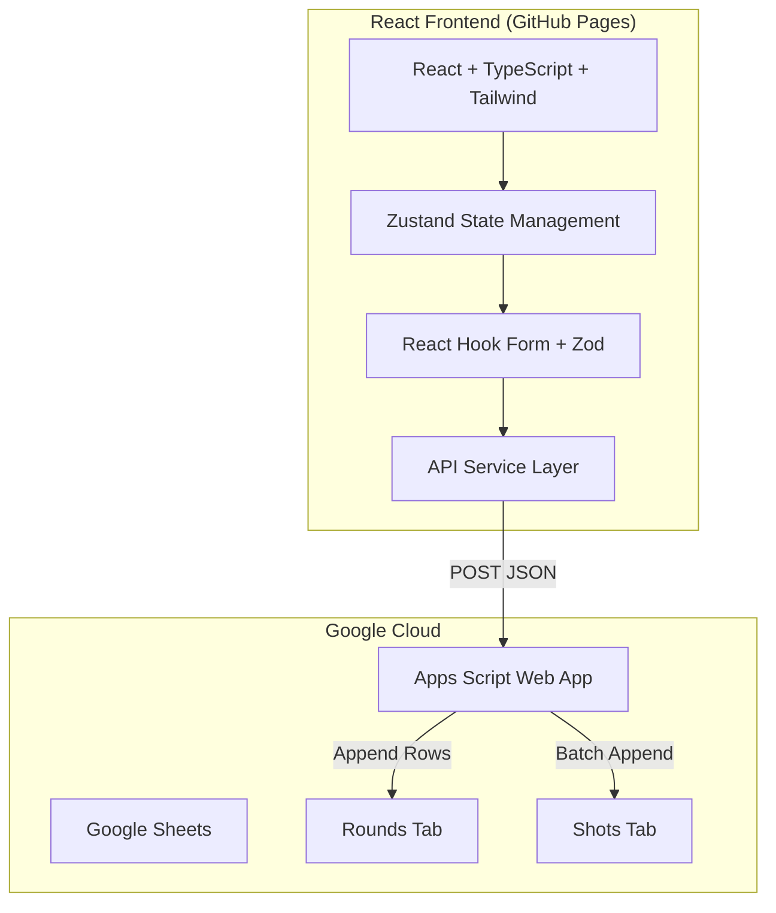
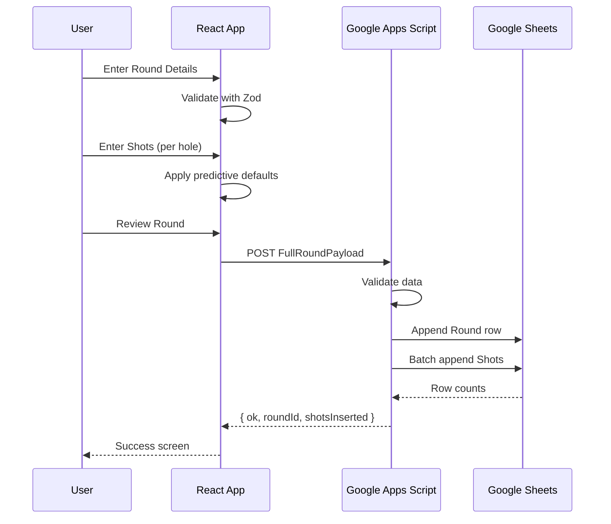

# Shot-Level Golf Entry App - Implementation Plan (v1.0)

## Design System: Golf Intelligence Theme (v1.6)

This app will use the exact color system, typography, and components from your existing Golf Intelligence dashboard, adapted for the round entry flow.

### Typography
| Element | Font | Weight | Usage |
|---------|------|--------|-------|
| Headings | Cormorant Garamond | 300/400 | Page titles, large numbers |
| Labels | DM Mono | 300/400 | Form labels, captions, data |
| Body | Outfit | 300/400 | UI text, navigation |

### Color Tokens (from dashboard)
```css
/* Foundation — Warm Grey */
--linen: #F4F3F1       /* Page background */
--parchment: #ECEAE7   /* Recessed areas */
--stone: #DCDAD6       /* Borders, dividers */
--pewter: #8F9490      /* Labels, captions */
--flint: #5E6460       /* Secondary text */
--ink: #252220         /* Primary text */
--white: #FFFFFF       /* Card surfaces */

/* Brand — Forest Green (UI only) */
--forest: #2D4A2D      /* Primary CTA, selected states */
--canopy: #1E3320      /* Pressed states */
--grove: #3D6640       /* Hover states */
--forest-tint: #EBF0EB /* Hover backgrounds */

/* Gold — Premium Accent */
--gold: #B8973A        /* Key metrics, brand */
--gold-light: #D4AF5A  /* Highlights */
--gold-tint: #F7F4EA  /* Subtle washes */

/* Score Semantics */
--under: #2D6B4A       /* Under par */
--even: #8A9890        /* Even par */
--bogey: #C07840       /* Bogey */
--double: #A84830      /* Double+ */

/* Strokes Gained Scale */
--sg-strong: #2D6B4A   /* +1.0+ */
--sg-gain: #5A9E7A     /* +0.3 to +0.9 */
--sg-neutral: #B8973A  /* ±0.3 */
--sg-loss: #C07840     /* -0.3 to -0.9 */
--sg-weak: #A84830     /* -1.0+ */
```

### UI Components (from dashboard)
- **Hero Cards**: White surface, stone border, colored top line, 60px Cormorant value
- **Stat Cards**: White surface, stone border, 38px Cormorant value
- **Buttons**: Primary (forest), Outline (forest border), Gold (gold border)
- **Score Pills**: Rounded pills with semantic colors

## Project Overview

This is a mobile-first post-round golf shot entry application with React frontend and Google Apps Script backend connecting to Google Sheets.

## System Architecture



## Data Flow



## Phase Breakdown

### Phase 1: Project Setup
- Initialize React + Vite + TypeScript project
- Install: `zustand`, `react-hook-form`, `@hookform/resolvers`, `zod`, `uuid`, `date-fns`
- Configure Tailwind CSS with Golf Intelligence theme:
  - Add custom colors (linen, forest, gold, score colors, etc.)
  - Add custom fonts (Cormorant Garamond, DM Mono, Outfit)
  - Mobile-first breakpoints
- Create `src/theme/index.ts` with design tokens and CSS variables
- Create folder structure:
  ```
  src/
  ├── theme/           # Design tokens, CSS variables
  ├── components/
  │   ├── ui/          # Reusable UI components (Button, Input, Card, etc.)
  │   ├── forms/       # Form-specific components
  │   └── screens/     # Screen components
  ├── stores/          # Zustand stores
  ├── types/           # TypeScript types
  ├── schemas/         # Zod validation schemas
  ├── hooks/           # Custom hooks
  ├── utils/           # Helper functions
  ├── services/        # API integration
  └── pages/           # Route pages
  ```

### Phase 2: TypeScript Types
Define all interfaces from spec in `src/types/index.ts`:
- Enums: Lie, DistanceUnit, CourseDifficulty, Weather, PuttLeave
- Round interface (with all required fields)
- Shot interface (with all fields including optionals)
- API types: FullRoundPayload, SuccessResponse, ErrorResponse

### Phase 3: State Management
Create Zustand stores:
- `useRoundStore`: Round details, current hole, submission state
- `useShotsStore`: Shots organized by hole number, CRUD operations

### Phase 4: Validation Schemas
Create Zod schemas:
- `roundDetailsSchema`: All round fields required, tournament required
- `shotSchema`: Validates lie/distance combinations, holed rules

### Phase 5: UI Components (styled to match Golf Intelligence theme)
Build reusable components using the exact dashboard design tokens:
- **Button** (variants: primary [forest], outline [forest border], gold [gold border])
- **Input**, Select, TextArea (white background, stone border, pewter labels)
- **ChipGroup** (for endLie selection - matches dashboard chip style)
- **Card** (white surface, stone border, gradient background per dashboard)
- **Header** (matches dashboard header style)
- **ScorePill** (rounded pills with semantic colors from dashboard)
- **LoadingSpinner**, ErrorMessage

### Phase 6-9: Screens
Implement all 4 screens with full business logic:

**Round Details Screen:**
- All required fields with validation
- Tournament is required (per spec)
- Date picker, course name input

**Shot Entry Screen:**
- Header: Hole X | Shot #Y | Total Z
- Shot form with all contextual logic
- Predictive endLie (per rules in spec)
- Auto unit switching (yards/feet)
- "I did NOT hit driver" for Tee ≥250y
- First putt leave for putts ≥10ft
- Mini Hole Summary (below on mobile, right column on desktop)

**Round Review Screen:**
- Hole-by-hole cards
- Edit shot modal
- Edit hole panel
- Validation: exactly one holed per hole

**Submit Screen:**
- API POST to GAS
- Success/Error handling
- Display submitted round ID

### Phase 10: Business Logic
Create utility functions:
- `predictEndLie(startLie, startDistance)`: Per spec rules
- `getDefaultUnit(lie)`: Green→feet, else yards
- `calculateShotNumber()`: Auto-increment
- `advanceOnHoled()`: Handle hole advancement

### Phase 11: API Integration
- Create `src/services/api.ts`
- POST to GAS endpoint
- Handle all response types
- Environment variable for GAS URL

### Phase 12: Google Apps Script (GAS)
Since you're new to GAS, here's what we'll create:

**Setup Steps (included in instructions):**
1. Create new Google Sheet
2. Add headers to Rounds and Shots tabs
3. Open Extensions → Apps Script
4. Paste Code.gs
5. Set SPREADSHEET_ID constant
6. Deploy as Web App (Execute as: Me, Anyone)

**Code.gs Features:**
- `doPost(e)`: Parse JSON payload
- Validation (round required, shots non-empty, hole bounds)
- Check for duplicate roundId
- Handle replaceExisting flag
- Append to Rounds sheet
- Batch append to Shots sheet
- Return JSON response

### Phase 13: Deployment
- Configure Vite `base: '/RoundEntryMaster/'` for GitHub Pages
- Add build/deploy scripts to package.json
- Create `.env.example` for GAS URL configuration

## Key Business Rules (from spec)

| Rule | Implementation |
|------|----------------|
| First shot startLie | Locked to 'Tee' |
| Units by lie | Green→feet, off-Green→yards |
| Predictive endLie | Tee≤225y→Green, >225y→Fairway; others→Green |
| Holed | endLie='Green', endDistance=0, advance hole |
| Driver option | Only Tee + startDistance ≥250y |
| Putt leave | First putt + startDistance ≥10ft |
| Penalty | +1 stroke, still record shot |
| Exactly one holed | Per hole validation in review |

## Acceptance Criteria Checklist

1. ✅ Round Details requires all fields incl. Tournament
2. ✅ Hole start: Tee locked; predictive end-lie works; units switch
3. ✅ Driver option only on Tee ≥250y
4. ✅ First putt leave only on first putt ≥10ft
5. ✅ Holed sets 0ft & advances; exactly one holed per hole
6. ✅ Mini Hole Summary below (mobile) / right column (desktop)
7. ✅ Review/Submit writes to Rounds + Shots; submitted_at by backend
8. ✅ Duplicate round blocked unless replaceExisting=true
9. ✅ Errors returned as ok:false; client shows retry
10. ✅ No partial writes on replace

## Next Steps

Once you approve this plan, I'll switch to **Code mode** to begin implementation starting with Phase 1 (Project Setup).
